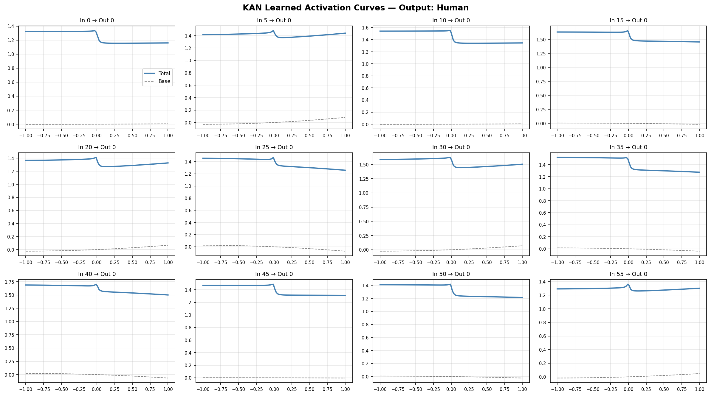
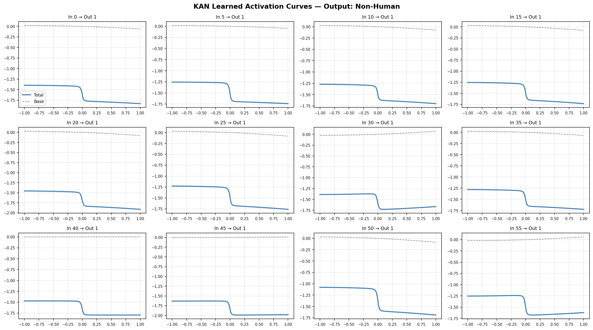

# On-Device FastKAN: Deploying a Kolmogorov-Arnold Network Head on Android

[](https://wandb.ai)
[](https://github.com/ZiyaoLi/fast-kan)
[](https://huggingface.co/spaces/armanmayub/KAN-mobile)

The goal of this project is to deploy a **FastKAN** (Kolmogorov-Arnold Network) classification head on an Android device and run it in real time on live camera video. FastKAN replaces standard linear layers with learnable univariate functions approximated using RBF spline weights, making each edge of the network intrinsically interpretable.

The model uses a frozen **MobileNetV2** backbone (pretrained on ImageNet) paired with a **FastKAN head** for binary human/non-human classification. The KAN head is exported to ONNX with its intermediate 64-dimensional hidden activations exposed, which drive a real-time signal visualizer built into the Android app.

A standard MLP head is included as a baseline for accuracy and latency comparison.

> **Note on parameters:** FastKAN edges carry both base weights and RBF spline weights, so the KAN head has significantly more parameters than the MLP at this input size (1280 backbone features). The comparison is about **on-device deployment and interpretability**, not parameter efficiency.

## Key Features
- **FastKAN on Android:** Full end-to-end pipeline from training to on-device inference via ONNX Runtime
- **Live KAN visualizer:** 64 animated bars showing the FastKAN hidden layer activations in real time, color-coded by class confidence
- **Interpretable activation curves:** Each FastKAN edge learns a visualizable univariate function — exported as PNGs for inspection
- **Honest A/B comparison:** Same frozen backbone, same data — only the classification head differs
- **W&B tracking:** Full experiment logging — accuracy, loss, F1, precision, recall, mAP, latency

## What this project explores
- **FastKAN architecture:** How RBF basis functions approximate spline weights for efficient KAN computation
- **MLP vs. FastKAN:** Fixed node activations (MLP) vs. learnable edge activation curves (FastKAN)
- **Mobile deployment:** Exporting a FastKAN model to ONNX and running it on Android with CameraX + ONNX Runtime
- **Interpretability in practice:** What do the learned FastKAN activation curves look like on real MobileNetV2 vision features?

## 🛠️ Setup & Execution

### 1. Conda Environment (Recommended)
This project uses Conda for easy cross-deployment and dependency management.

```bash
# Create the environment from the .yml file
conda env create -f environment.yml

# Activate the environment
conda activate kan-human-env

# Log in to Weights & Biases
wandb login
```

### 2. Dataset
Download the [Human and Not Human Dataset](https://www.kaggle.com/datasets/aliasgartaksali/human-and-non-human) and place it in the `data/` folder.

### 3. Training & Tracking
```bash
# Train the Baseline (MLP head)
python src/train.py --config configs/config_baseline.yaml

# Train the FastKAN version
python src/train.py --config configs/config_kan.yaml
```

### 4. Interactive Analysis
Open `analysis.ipynb` to compare models and visualize the learned curves.

## 📊 Results

Both models trained on the same frozen MobileNetV2 backbone (10 epochs, Adam lr=0.001).

| Metric | Baseline (MLP) | KAN |
|--------|---------------|-----|
| Trainable params | 2,562 | 741,186 |
| Best val accuracy | 100.00% | 100.00% |
| **Test accuracy** | **99.93%** | 99.60% |
| Test mAP | 1.0000 | 1.0000 |
| Test F1 | 0.9992 | 0.9958 |
| Test Precision | 0.9985 | 0.9917 |
| Test Recall | **1.0000** | **1.0000** |
| Inference latency | 2.71ms | **1.92ms** |
| Epochs to 100% val | 9 | **2** |

**Key findings:**
- KAN matched the baseline within 0.33% test accuracy despite a fundamentally different architecture
- KAN converged 4× faster (100% val accuracy at epoch 2 vs epoch 9)
- Both models achieve perfect recall — no human is ever misclassified as non-human
- KAN is faster at inference (1.92ms vs 2.71ms) due to efficient RBF computation

## 🔍 KAN Interpretability

Unlike MLP weights (uninterpretable scalars), KAN edges learn visualizable univariate functions. Below are the learned activation curves from the final classification layer:

**Human class (Output 0):**


**Non-Human class (Output 1):**


The Non-Human curves show clear **sigmoid-like step functions** — the model learned sharp thresholds on specific hidden features, revealing the decision logic that a standard MLP cannot expose.

## 🖥️ Demo
Launch the Gradio interface for live inference:
```bash
python src/demo.py
```

## 📤 ONNX Export

Two variants are available depending on the deployment target:

| Variant | Output | Use case |
|---------|--------|----------|
| Standard | `logits [2]` | HF Space, general inference |
| With hidden | `logits [2]` + `hidden [64]` | Android live visualizer |

```bash
# Standard — for HF Space or general inference
python src/onnx_export.py --model-path models/kan_best.pth

# With hidden activations — for Android live KAN visualizer
python src/onnx_export.py --model-path models/kan_best.pth \
    --with-hidden --output-path models/kan_model_android.onnx
```

The `hidden` output contains the 64-dimensional activations from the first
FastKAN layer, used to drive the real-time signal visualizer in the Android app.

## 📱 Android App

The `android/` directory is a complete Android Studio project (minSdk 26).

**Stack:**
- CameraX 1.3.x — live camera preview + frame analysis
- ONNX Runtime Android 1.17.0 — on-device FastKAN inference
- Custom `KANVisualizerView` — 64 lerp-smoothed equalizer bars driven by the FastKAN hidden activations, blue for Human, red for Non-Human

**To build and run:**
1. Open `android/` in Android Studio
2. Let Gradle sync (downloads dependencies on first run)
3. Enable USB Debugging on your Android phone and hit Run

The ONNX model (`kan_model_android.onnx`) is bundled as an asset and loaded at startup. Inference runs entirely on-device — no network calls.
